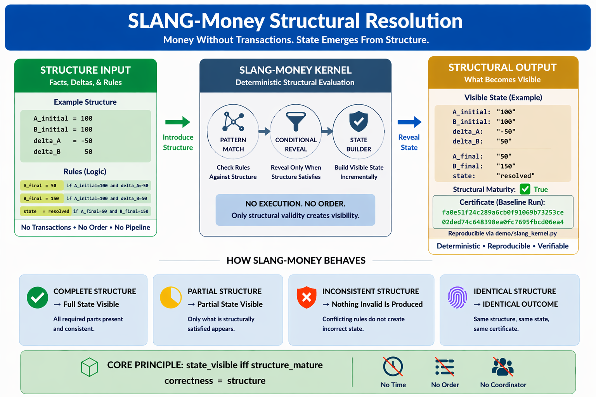

# ⭐ SLANG-Money

**Money Without Transactions — Structural Resolution Kernel**


[](https://github.com/OMPSHUNYAYA/SLANG-Money/actions/workflows/slang-money-verify.yml)

## **Money Without Transactions: A 2.06 KB Proof That Financial State Does Not Require Execution**

A minimal deterministic kernel (~2.06 KB) where financial state emerges directly from structure — not from movement.

**Structure-Based Resolution • No Transactions • No Settlement • No Sequence**

**No Time • No Order • No Coordinator • No Execution Pipeline**

---

Financial correctness derived from structure — not from transaction flow, order, or synchronization.

Built on structure-first principles from the Shunyaya framework.

---

## ⚡ **Try it in 30 seconds**

Run the kernel:

```
python demo/slang_kernel.py
```

Run again:

```
python demo/slang_kernel.py
```

Modify one line, then run again:

```
python demo/slang_kernel.py
```

In under a minute, observe:

- deterministic resolution without transactions
- incomplete structure does not produce full visible state
- identical final state across runs
- structural maturity governs visibility
- conflicting structure is handled conservatively (ABSTAIN in full model)

---

## ⚡ **The One-Line Breakthrough**

A financial state can emerge correctly without any transaction being executed.

No settlement. No movement. No sequencing.

Yet correctness holds — when structure is complete.

---

## 🧭 **Visual Overview**



---

## 🧾 **Structural Lineage**

SLANG-Money-Kernel represents the next layer beyond ORL-Money:

- ORL-Money → multi-node structural reconciliation
- SLANG → single-node structural resolution

It shows that:

**money correctness does not require transactions**

---

## 🔗 **Quick Links**

### 📘 Docs

- [Quickstart](docs/Quickstart.md)  
- [FAQ](docs/FAQ.md)  
- [Proof Sketch](docs/Proof-Sketch.md)  
- [Reference Demonstration](docs/SLANG-Money-Reference-Demonstration.md)  
- [Structural Overview](docs/Slang-Money-Structural-Resolution.png)  

### ⚡ Demo

- [Python Reference Kernel](demo/slang_kernel.py)  

### 🔍 Verification

- [Verify Instructions](VERIFY/VERIFY.txt)  
- [Demo Hash Freeze](VERIFY/FREEZE_DEMO_SHA256.txt)  

---

## 📂 Repository

- [demo](demo/) — minimal deterministic reference kernel  
- [docs](docs/) — conceptual explanation, proof, and usage  
- [VERIFY](VERIFY/) — reproducibility and deterministic verification  

---

## 💡 **What This Kernel Demonstrates**

This system proves that financial correctness does not require:

- transactions
- settlement pipelines
- execution flow
- ordering
- synchronization

Instead:

`correctness = structure`

---

## ⚖️ **What This Is / Is Not**

### **SLANG-Money-Kernel IS:**

- a minimal structural resolution kernel
- a deterministic financial state generator
- a proof that transactions are not fundamental
- a structure-first correctness demonstration

### **SLANG-Money-Kernel IS NOT:**

- a full financial system
- a payment engine
- a settlement system
- a production-ready ledger

It is the smallest visible proof of structural money resolution.

---

## 🔥 **The Core Structural Law**

`structure_complete -> state_visible`  
`structure_incomplete -> partial_visible_state (full state not visible)`  
`structure_conflicting -> no_visible_state`

Or:

`state_visible iff structure_mature`

---

## 🛡 **Structural Safety Model**

`incomplete -> no forced state`  
`conflicting -> no unsafe state`  
`complete -> deterministic state`

No guessing. No forcing. No artificial completion.

---

## **No Partial State Guarantee**

The system does not produce partially incorrect outcomes.

If structure is incomplete:

- no incorrect state is produced
- no approximation is made

Only structurally valid states become visible.

Incomplete structure does not produce full state visibility.

---

## 🧮 **Deterministic Guarantees**

**Determinism:**  
Same structure → same outcome

**Order Independence:**  
Rule order does not affect final result

**Idempotence:**  
Repeated execution → identical output

**Structural Maturity:**  
State appears only when structure is complete

**Certificate Stability:**  
Final structure produces reproducible hash

---

## 🔐 **Structural Certificate**

The final visible state produces a deterministic structural certificate:

`same structure -> same certificate`

The certificate is:

- reproducible
- verifiable
- independent of execution
- independent of transaction history

This makes the final structure itself a form of proof.

**Note:**  
The structural certificate is derived from the resolved structure, not from the file itself.  
Identical structure produces identical certificates, independent of file representation.

---

## 📁 **Verification**

Deterministic outputs and reproducibility can be verified using:

- VERIFY/FREEZE_DEMO_SHA256.txt
- VERIFY/VERIFY.txt

---

## 🧭 **The Scenario**

Initial state:

A_initial = 100  
B_initial = 100  
delta_A = -50  
delta_B = 50

Important: `delta_A` and `delta_B` represent structural claims, not executed movements.  
They define relationships used for resolution, not transfers that have already occurred.

No transaction is executed.

---

## ⚙️ **Structural Resolution**

The system applies structure repeatedly until stable:

`resolve(structure)`

Final result:

A_final = 50  
B_final = 150  
state = resolved

---

## 🔍 **What Changes When Structure Breaks**

Modify:

`delta_B = 40`

Run again:

```
python demo/slang_kernel.py
```

Result:

- A_final appears
- B_final missing
- state missing

---

## 🧠 **Critical Insight**

system does not fail  
system does not guess  
**system does not approximate**

Instead:

**structure is not yet mature**

---

## 🔁 **Order Independence Proof**

Reorder rules → run:

```
python demo/slang_kernel.py
```

Result:

**identical output**

---

## 🔁 **Direct State Injection**

Start from:

A_final = 50  
B_final = 150

Run:

```
python demo/slang_kernel.py
```

Result:

state resolves immediately

---

## 🔁 **Partial Injection**

Start from:

A_final = 50

Run:

```
python demo/slang_kernel.py
```

Result:

no additional state appears

---

## 🔁 **Final-State Start**

Start from:

state = resolved

Run:

```
python demo/slang_kernel.py
```

Result:

state remains resolved

---

## 🧠 **What This Means**

- no transaction was required
- no settlement occurred
- no movement happened

**state emerged from structure**

---

## ⚡ **What This Challenges**

Traditional assumption:

`money correctness = transaction + settlement + order`

This kernel shows:

`money correctness = structure`

---

## 🧱 **Minimal Integration**

`input structure -> resolve -> visible state`

---

## 🔍 **Optional — Observe Resolution (TRACE Mode)**

Enable:

`TRACE = True`

Run:

```
python demo/slang_kernel.py
```

You will see step-by-step structural propagation:

- `-> Set B_final = 150`
- `-> Set A_final = 50`
- `-> Set state = resolved`

Then revert:

`TRACE = False`

---

## 🧩 **Kernel Surface**

Core mechanism:

- rule evaluation
- structural propagation
- convergence loop
- visibility filtering
- certificate generation

**Minimal • Deterministic • Reproducible**

---

## 📊 **Comparison**

| Model        | Transaction Required | Execution Required | State from Structure | Safe Local Visibility | Deterministic |
|--------------|----------------------|--------------------|----------------------|-----------------------|---------------|
| Traditional  | Yes                  | Yes                | No                   | Limited               | Conditional   |
| Eventual     | Yes                  | Yes                | Partial              | Partial               | Conditional   |
| Ledger-Based | Yes                  | Yes                | No                   | Limited               | Conditional   |
| SLANG-Money  | No                   | No                 | Yes                  | Yes                   | Yes           |

---

## 🌍 **Implications**

If this scales:

- transactions become optional
- settlement becomes secondary
- audit becomes structural
- state becomes proof

---

## 🧭 **Relationship to ORL-Money**

**ORL-Money:**

- multi-node
- reconciliation across systems

**SLANG-Money-Kernel:**

- single-node
- resolution without transactions

Together:

**structure-first financial correctness across layers**

---

## **The Structural Elimination Framework**

| Domain      | Removed Dependency | What Preserves Correctness |
|-------------|--------------------|----------------------------|
| Time        | clocks             | structure                  |
| Decision    | order              | structure                  |
| Meaning     | sequence           | structure                  |
| Money       | transactions       | structure                  |
| Truth       | agreement          | structure                  |
| Computation | execution          | structure                  |
| AI          | inference          | structure                  |

---

## 📜 **License**

See: [LICENSE](LICENSE)

**Reference Implementation:**  
Open Standard — free to use, study, implement, extend, and deploy

**Architecture and Documentation:**  
CC BY-NC 4.0

---

## 🔭 **Roadmap (Exploratory)**

This release focuses on minimal structural proof.

Planned explorations include:

- escrow-like conditional structures
- structural audit and invariant validation
- multi-party structural resolution
- conflict classification models
- persistence and replay of structure
- distributed structural convergence

These are extensions of the same principle:

`correctness = structure`

The paradigm is visible. Opportunities to extend its impact are manyfold.

This release proves the principle in finance. Extensions are exploratory.

---

## 🔗 **Related Structural References**

- [ORL-Money](https://github.com/OMPSHUNYAYA/ORL-Money) — multi-node structural money reconciliation  
- [ORL](https://github.com/OMPSHUNYAYA/Orderless-Ledger) — orderless ledger for structural correctness  
- [STOCRS](https://github.com/OMPSHUNYAYA/STOCRS) — structure-first computation without execution  
- [STIME](https://github.com/OMPSHUNYAYA/Structural-Time) — structural time model (time from valid transitions)  
- [SSUM-Time](https://github.com/OMPSHUNYAYA/SSUM-Time) — structural clock engine (time reconstruction & recovery)  

---

## 🧭 **Final Statement**

Transaction did not create correctness.  
Settlement did not create correctness.  
Order did not create correctness.

**Correctness emerged from structure.**
